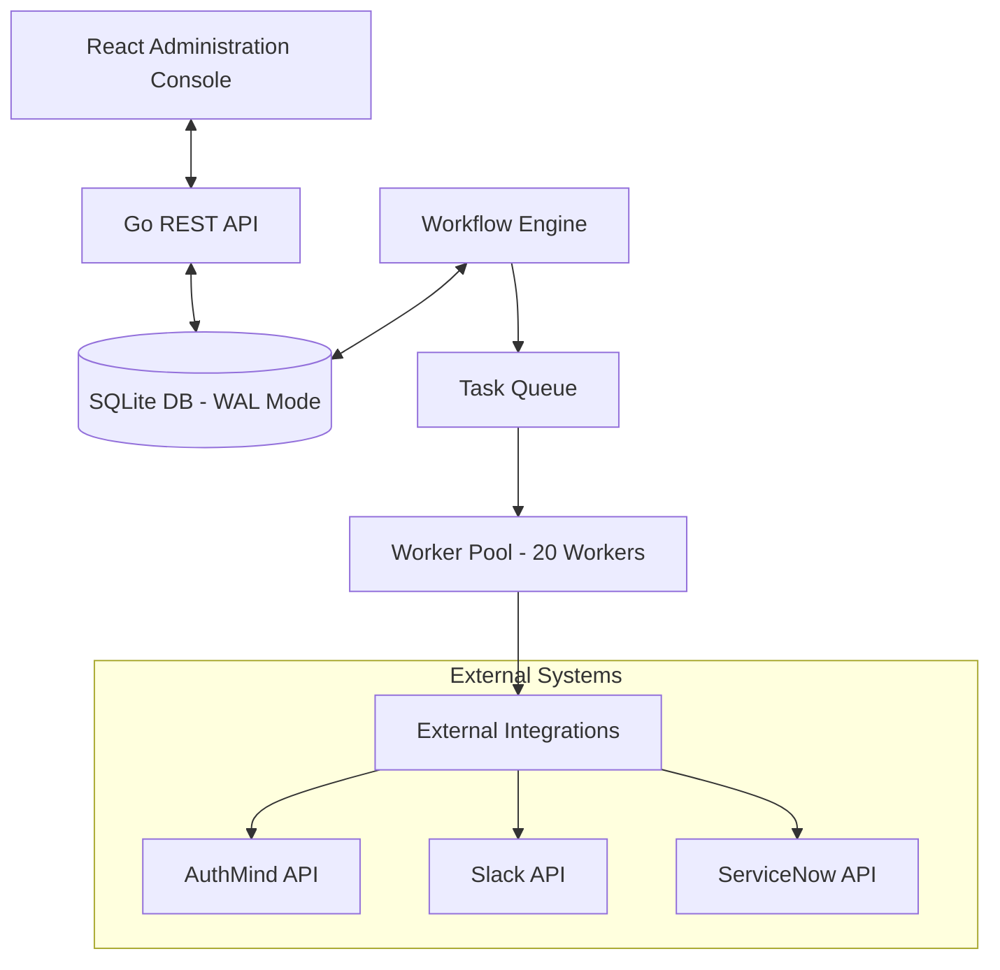

# System Architecture

This document provides a detailed overview of the Integration & Workflow Engine's internal architecture, data flow, and component interaction.

## High-Level Overview

The application is a distributed remediation system that bridges security monitoring (via AuthMind) with automated response actions (Slack, ServiceNow, etc.). It is designed for high performance, multi-tenancy, and reliability.

## Core Components

### 1. Workflow Engine (`internal/core/engine.go`)
The engine is the heart of the system. It handles:
- **Polling Scheduler:** Periodically checks for new issues across all enabled tenants and integrations.
- **Task Distribution:** Packages work into `PollingTask` units and submits them to a buffered channel.
- **Worker Pool:** A scalable set of concurrent goroutines that process tasks in parallel to ensure high throughput without blocking the main scheduler.
- **State Management:** Tracks "last-seen" IDs for polling to ensure no events are missed or double-processed.

### 2. Multi-Tenant Data Isolation (`internal/tenancy/`)
The system supports two modes of operation:
- **Single-Tenant:** Standard deployment where all data belongs to a default tenant.
- **Multi-Tenant:** SaaS-ready mode where every database record is scoped by `TenantID`. Isolation is enforced via GORM scopes and middleware that resolves tenant context from headers or API keys.

### 3. Integration SDKs (`internal/integrations/`)
A modular abstraction layer for interacting with third-party APIs. 
- **AuthMind SDK:** Specialized for fetching security issues and detailed incident metadata.
- **Generic Executor:** Uses `ActionDefinitions` (templates) to perform REST calls (GET, POST, etc.) with dynamic parameter mapping.

### 4. Database Layer (`internal/database/`)
- **SQLite with WAL:** Provides the performance of a traditional RDBMS while maintaining the portability of a single file.
- **GORM:** Used for ORM capabilities, including automatic migrations and encrypted sensitive fields (credentials).

## Data Flow: Issue Remediation

1. **Poll:** The Engine's scheduler triggers a poll of the AuthMind API.
2. **Ingest:** New issues are matched against enabled `Workflows` based on the issue type and minimum severity thresholds.
3. **Job Creation:** For every match, a `Job` is created in the database to track execution progress.
4. **Execute:** The `Executor` runs each step of the workflow:
    - Resolves the `ActionDefinition` template.
    - Interpolates context data (User Email, Issue ID, etc.) into the request body/URL.
    - Executes the network call.
    - Logs the response and status to `JobLogs`.
5. **Cleanup:** Daily retention workers prune old jobs and logs to keep the database size manageable.

## System Requirements

### Hardware Requirements (Minimum)
- **CPU:** 1 Core (x86_64 or ARM64)
- **RAM:** 512 MB
- **Storage:** 1 GB (SSD recommended for SQLite WAL performance)

### Software Prerequisites
- **Operating System:** Linux, macOS, or Windows (Docker recommended for production)
- **Runtime:** 
    - Go 1.21+ (for building from source)
    - Node.js 18+ (for frontend development)
- **Network:** Outbound access to target integration APIs (HTTPS).
